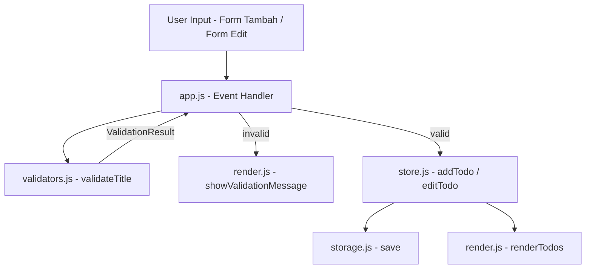

# Dokumen Desain Teknis: Validasi Panjang Deskripsi Todo

## Overview

Fitur ini memperketat validasi input deskripsi todo di aplikasi Todolist berbasis JavaScript vanilla. Saat ini, `isValidTitle` di `validators.js` hanya menolak string kosong atau whitespace-only. Fitur ini menambahkan batas panjang: **minimal 3 karakter** dan **maksimal 50 karakter** setelah trim.

Perubahan utama:
1. Fungsi `isValidTitle` diganti dengan fungsi baru `validateTitle` yang mengembalikan objek hasil validasi (bukan sekadar boolean), sehingga aplikasi dapat membedakan kondisi "kosong", "terlalu pendek", "terlalu panjang", dan "valid".
2. `app.js` diperbarui untuk menggunakan `validateTitle` dan menampilkan pesan error yang sesuai.
3. `store.js` diperbarui untuk menggunakan `validateTitle` pada fungsi `editTodo`.
4. Backward compatibility dijaga: data todo lama yang tersimpan di LocalStorage tetap dapat dimuat dan ditampilkan tanpa error.

---

## Architecture

Arsitektur aplikasi tidak berubah secara struktural. Perubahan terlokalisasi pada lapisan validasi dan lapisan presentasi pesan error.



**Alur validasi:**
1. User submit form → `app.js` mengambil nilai input
2. `app.js` memanggil `validateTitle(input.value)`
3. `validateTitle` mengembalikan `ValidationResult` dengan field `valid` (boolean) dan `error` (string | null)
4. Jika tidak valid, `app.js` memanggil `showValidationMessage` dengan pesan dari `result.error`
5. Jika valid, `app.js` melanjutkan ke `addTodo` / `editTodo` dengan nilai yang sudah di-trim

---

## Components and Interfaces

### `validators.js` — Fungsi Baru `validateTitle`

Fungsi `isValidTitle` yang ada saat ini dikembalikan tetap ada untuk backward compatibility, namun logikanya diperbarui. Fungsi baru `validateTitle` ditambahkan sebagai antarmuka utama.

```javascript
/**
 * @typedef {Object} ValidationResult
 * @property {boolean} valid - true jika deskripsi valid
 * @property {string|null} error - pesan error, atau null jika valid
 */

/**
 * Validasi panjang deskripsi todo.
 * @param {string} title
 * @returns {ValidationResult}
 */
export function validateTitle(title) {
  const trimmed = title.trim();
  if (trimmed.length === 0) {
    return { valid: false, error: 'Judul tugas tidak boleh kosong.' };
  }
  if (trimmed.length < 3) {
    return { valid: false, error: 'Judul tugas minimal 3 karakter.' };
  }
  if (trimmed.length > 50) {
    return { valid: false, error: 'Judul tugas maksimal 50 karakter.' };
  }
  return { valid: true, error: null };
}

/**
 * Backward-compatible wrapper. Returns true if title is valid.
 * @param {string} title
 * @returns {boolean}
 */
export function isValidTitle(title) {
  return validateTitle(title).valid;
}
```

**Keputusan desain:** Menggunakan objek `ValidationResult` (bukan enum atau kode error numerik) karena:
- Mudah dikonsumsi di `app.js` tanpa switch/case tambahan
- Pesan error langsung tersedia tanpa mapping terpisah
- Tetap backward compatible: `isValidTitle` tetap berfungsi sebagai boolean wrapper

### `app.js` — Perubahan Handler

Fungsi `handleAddTodo` dan `saveEdit` diperbarui untuk menggunakan `validateTitle`:

```javascript
// Sebelum:
if (!isValidTitle(title)) {
  showValidationMessage(validationMsg, 'Judul tugas tidak boleh kosong.');
  return;
}

// Sesudah:
const result = validateTitle(title);
if (!result.valid) {
  showValidationMessage(validationMsg, result.error);
  return;
}
```

### `store.js` — Perubahan `editTodo`

```javascript
// Sebelum:
export function editTodo(id, newTitle) {
  if (!isValidTitle(newTitle)) return;
  ...
}

// Sesudah:
export function editTodo(id, newTitle) {
  if (!validateTitle(newTitle).valid) return;
  ...
}
```

### `render.js` — Tidak Ada Perubahan

`showValidationMessage` sudah cukup fleksibel menerima pesan string apapun. Tidak perlu modifikasi.

---

## Data Models

### `ValidationResult`

```javascript
/**
 * @typedef {Object} ValidationResult
 * @property {boolean} valid
 * @property {string|null} error
 */
```

Tiga kemungkinan nilai:
| Kondisi | `valid` | `error` |
|---|---|---|
| Kosong / whitespace-only | `false` | `'Judul tugas tidak boleh kosong.'` |
| Trimmed length < 3 | `false` | `'Judul tugas minimal 3 karakter.'` |
| Trimmed length > 50 | `false` | `'Judul tugas maksimal 50 karakter.'` |
| Trimmed length 3–50 | `true` | `null` |

### Todo Object (tidak berubah)

```javascript
{
  id: string,        // UUID
  title: string,     // deskripsi yang sudah di-trim, 3-50 karakter
  completed: boolean,
  createdAt: number  // timestamp ms
}
```

Data todo lama di LocalStorage yang memiliki `title` dengan panjang di luar batas baru tetap dimuat dan ditampilkan apa adanya — tidak ada migrasi atau penolakan saat load.

---

## Correctness Properties

*A property is a characteristic or behavior that should hold true across all valid executions of a system — essentially, a formal statement about what the system should do. Properties serve as the bridge between human-readable specifications and machine-verifiable correctness guarantees.*

### Property 1: Batas panjang validator konsisten

*For any* string, `validateTitle` SHALL mengembalikan `valid: false` jika panjang setelah trim kurang dari 3 atau lebih dari 50, dan `valid: true` jika panjang setelah trim antara 3 dan 50 (inklusif).

**Validates: Requirements 1.1, 1.2, 1.3, 1.4**

### Property 2: Whitespace-only selalu ditolak dengan pesan kosong

*For any* string yang seluruhnya terdiri dari karakter whitespace, `validateTitle` SHALL mengembalikan `valid: false` dengan `error` berisi `'Judul tugas tidak boleh kosong.'`.

**Validates: Requirements 1.1, 2.1, 3.1, 5.1**

### Property 3: Input invalid tidak mengubah todo list

*For any* todo list dan string input yang tidak valid (kosong, terlalu pendek, atau terlalu panjang), operasi tambah maupun edit SHALL tidak mengubah isi todo list.

**Validates: Requirements 2.1, 2.2, 2.3, 3.1, 3.2, 3.3**

### Property 4: Input valid menghasilkan todo tersimpan dengan deskripsi yang benar

*For any* string dengan trimmed length antara 3 dan 50 karakter, menambahkan todo dengan string tersebut SHALL menghasilkan todo baru di list dengan `title` sama dengan nilai setelah trim.

**Validates: Requirements 2.4, 3.4, 5.2**

### Property 5: Backward compatibility — load data lama tidak error

*For any* array todo objects (termasuk yang memiliki `title` dengan panjang di luar batas baru), memuat array tersebut ke state dan memanggil `renderTodos` SHALL tidak melempar error dan menampilkan semua todo.

**Validates: Requirements 5.3**

---

## Error Handling

### Validasi Input

| Kondisi | Pesan Error | Aksi |
|---|---|---|
| String kosong atau whitespace-only | `'Judul tugas tidak boleh kosong.'` | Tampilkan pesan, batalkan operasi |
| Trimmed length 1–2 karakter | `'Judul tugas minimal 3 karakter.'` | Tampilkan pesan, batalkan operasi |
| Trimmed length > 50 karakter | `'Judul tugas maksimal 50 karakter.'` | Tampilkan pesan, batalkan operasi |

### Perilaku Pesan Error

- Pesan ditampilkan via `showValidationMessage` yang sudah ada di `render.js`
- Pesan otomatis hilang setelah 3 detik
- Pesan hilang saat user mulai mengetik (input event listener)
- Pesan hilang saat operasi berhasil (todo ditambah/diedit)

### Data Lama di LocalStorage

Tidak ada penanganan error khusus untuk data lama. Todo dengan deskripsi di luar batas baru tetap ditampilkan apa adanya. Validasi hanya berlaku untuk operasi **tulis** (tambah/edit), bukan operasi **baca** (load/render).

---

## Testing Strategy

### Framework

- **Test runner**: Vitest (sudah terkonfigurasi di proyek)
- **Property-based testing**: fast-check (sudah tersedia sebagai devDependency)
- **Minimum iterasi per property test**: 100 runs

### Unit Tests (`tests/validators.test.js`)

Test spesifik untuk `validateTitle`:

- String kosong → `{ valid: false, error: 'Judul tugas tidak boleh kosong.' }`
- String whitespace-only → `{ valid: false, error: 'Judul tugas tidak boleh kosong.' }`
- String 1 karakter → `{ valid: false, error: 'Judul tugas minimal 3 karakter.' }`
- String 2 karakter → `{ valid: false, error: 'Judul tugas minimal 3 karakter.' }`
- String 3 karakter (batas bawah) → `{ valid: true, error: null }`
- String 50 karakter (batas atas) → `{ valid: true, error: null }`
- String 51 karakter → `{ valid: false, error: 'Judul tugas maksimal 50 karakter.' }`
- String dengan leading/trailing spaces: `'  ab  '` (trimmed = 2) → `{ valid: false, error: 'Judul tugas minimal 3 karakter.' }`
- String dengan leading/trailing spaces: `'  abc  '` (trimmed = 3) → `{ valid: true, error: null }`
- Backward compat: `isValidTitle('abc')` → `true`, `isValidTitle('ab')` → `false`

### Property-Based Tests (`tests/validators.test.js`)

**Feature: todo-description-validation, Property 1: batas panjang validator konsisten**
```javascript
// Generate string dengan trimmed length < 3 → harus invalid
// Generate string dengan trimmed length > 50 → harus invalid
// Generate string dengan trimmed length 3-50 → harus valid
```

**Feature: todo-description-validation, Property 2: whitespace-only selalu ditolak dengan pesan kosong**
```javascript
// Generate whitespace-only string → error harus 'Judul tugas tidak boleh kosong.'
```

**Feature: todo-description-validation, Property 3: input invalid tidak mengubah todo list**
```javascript
// Generate todo list + invalid input → addTodo/editTodo tidak mengubah list
```

**Feature: todo-description-validation, Property 4: input valid menghasilkan todo tersimpan**
```javascript
// Generate valid string (trimmed 3-50) → todo ditambahkan dengan title = trimmed value
```

**Feature: todo-description-validation, Property 5: backward compatibility load data lama**
```javascript
// Generate array todo dengan title berbagai panjang → renderTodos tidak throw
```

### Integration Tests (`tests/store.test.js`)

- `addTodo` dengan judul valid → todo ditambahkan ke `state.todos`
- `editTodo` dengan judul valid → `todo.title` diperbarui
- `editTodo` dengan judul invalid → `todo.title` tidak berubah

### Catatan: Mengapa PBT Sesuai untuk Fitur Ini

`validateTitle` adalah pure function dengan input/output yang jelas. Ruang input sangat besar (semua kemungkinan string), dan variasi input sangat relevan untuk menemukan edge case (karakter unicode, mixed whitespace, string dengan spasi di tengah, dll). Property-based testing dengan fast-check sangat tepat untuk memverifikasi batas panjang secara komprehensif.
